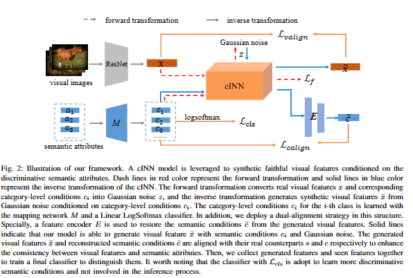
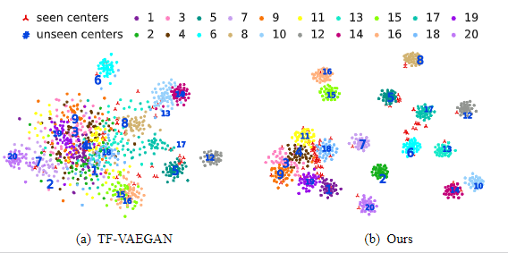

# Dual-Aligned Feature Confusion Alleviation for Generalized Zero-Shot Learning

Hongzu Su, Jingjing Li, Ke Lu, Lei Zhu,Heng Tao Shen




Abstract: Generalized zero-shot learning (GZSL) aims to recognize both seen and unseen samples by leveraging the connections between semantic and visual representations. Recently, a majority of GZSL methods focus on generating visual features for unseen categories conditioned on category-level semantic attributes. However, there is a considerable gap between generated features and real unseen features since the generator is trained with only seen samples. The final classifier may get confused by the unfaithful generated features and make misclassification. To alleviate this issue, we propose a dual-aligned feature confusion alleviation (DFCA) framework that simultaneously generates faithful and discriminative features for unseen categories.  Specifically, our DFCA attains the faithfulness via a conditional invertible neural network (cINN) and aligns the generated visual features and reconstructed semantic conditions with their real counterparts, respectively. To further encourage distinguishable synthetic features, we learn discriminative category-level semantic conditions for cINN with an attributes mapping layer. To verify the proposed method, we conduct extensive experiments on five widely used benchmarks. Experimental results show that our method outperforms previous state-of-the-arts and successfully alleviates features confusion problem in GZSL. For instance, our method achieves the best performance in terms of seen accuracy, unseen accuracy and harmonic mean accuracy on FLO.

# Environments
- conda environment
```
conda env create -f env.yaml
```
- FrEIA 
```
git clone https://github.com/VLL-HD/FrEIA.git
cd FrEIA
git checkout 550257b10af7d8772b08d4aa9b18772e2c02
python setup.py install
```

# Usage

You can download [datasets](https://drive.google.com/drive/folders/1IcQWpKk9ZBYlE1x4rRKsF9kdj5KXe6PA?usp=sharing) in data folder and run the scripts:
```
python train_FLO.py
```
The visualization result on FLO:

